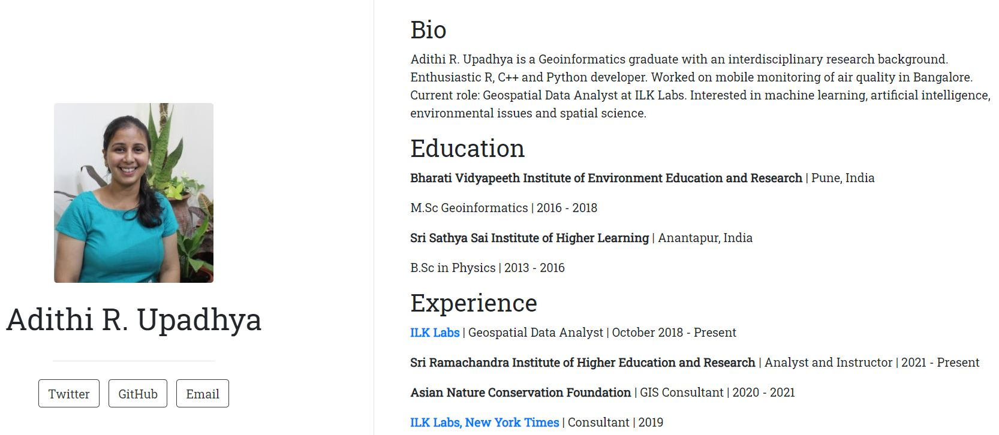
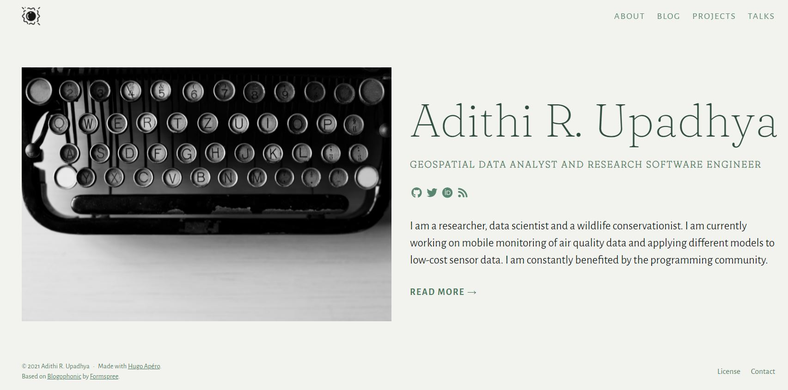

I have been wanting to make a personal website forever, but I am also a person who is super bad with colour combinations, beautification of stuff. So I kept pushing this, till I stumbled on [Silvia's website](https://silvia.rbind.io/). I directly contacted her and she was very nice and sweet to help me out throughout this. This website has been heavily inspired by Silvia's. 

## Why website(s)

I already had a [website](https://adithirgis.netlify.app/), but I wanted to add more content to it.  I was using my old website to share with people. So in the beginning of this year (2021), I was got selected for the [rstudio::global(2021)](https://blog.rstudio.com/2020/11/30/diversity-scholarships/) Diversity Scholarship to attend two workshops. This year we had two amazing educators [Mine «etinkaya-Rundel](https://www2.stat.duke.edu/~mc301/) and [Alison Hill](https://alison.rbind.io/). 


Now the first thing that came to mind while making personal websites was do I really need one? Or why would anyone need a personal website? Then I remembered that a few people who worked with me always recommended that I should I have a website, and I kept telling myself the same thing. Website could be a your collection of work and blogs to share with others. So, if you work (any kind of work) or you like to blog, then you should definitely have a website. I had another strong reason to make my own website, which is I get a chance to work with R!

Reiterating that I have been a benefactor of kind communities I wanted to communicate my research struggles, learning in a systematic manner. So here is on of the outcomes of this journey. 

## How website(s)

During the Diversity Scholar workshops we were encouraged to have our own website, check the materials [here](https://iyo-rstudio-global.netlify.app/). Alison's workshop had three ways to have your own website. There are many many ways, but here I discuss in brief only three. I won't be discussing much on building websites in blogdown as there are more informative articles / resources published, but I will try my best to add links to all the resources here. 

### First Method

Though this is not exactly a website, but this could definitely be used to write a short bio of yourself. 

Level : Everyone who owns a GitHub account. 

Requirements : [Github account](https://github.com/), your photo.

If you are not familiar with GitHub, I highly recommend using it. If you use R everyday then try [*Happy Git with R*](https://happygitwithr.com/). 

Number of minutes I took to complete it : 15

Procedure : 

- Create a new repository which has the same name as your username, eg: my user name in GitHub is adithirgis, so I will make a repo which I name as adithirgis. 

- Initialize the repo with a README.md, this is where you will write things. 

- This is a special repository, you can customize your repo. 

- You can add pictures, emoji's to this md file. 

- And definitely commit and push all the changes. 

- [Example](https://github.com/adithirgis) shown below of how it could look like. 


Detailed Resources :

- This is an awesome collection of variety of profiles, the links to the repo are also given - https://github.com/abhisheknaiidu/awesome-github-profile-readme. 

### Second Method

Level : Everyone who uses R. 

Requirements : [R](https://www.r-project.org/about.html), [RStudio](https://www.rstudio.com/), [rmarkdown](https://rmarkdown.rstudio.com/) package, [Netlify](https://www.netlify.com/), [postcards](https://github.com/seankross/postcards) package, your photo. 

Number of minutes I took to complete it : 35

Procedure : 

- Open RStudio and install postcards package as shown below.

- There are multiple templates available in postcard package. Choose one of them. 

```r
require(remotes)
remotes::install_github("seankross/postcards@main")
postcards::create_postcard(template = "trestles")
```

- An `index.Rmd` file will be generated, customize it and knit it. 

- [Example](https://adithiru-shortbio.netlify.app/) shown below of how it could look like. 



- Deploy it on [Netlify](https://bookdown.org/yihui/blogdown/netlify.html).

- You can as well fork this repo from [here](https://github.com/adithirgis/short_bio). 

Detailed Resources :

- Here is the repo of this package and many other examples - https://github.com/seankross/postcards#getting-started. 


### Third Method

I won't be discussing how to build the website from scratch as it has been beautifully and correctly done [here](https://hugo-apero-docs.netlify.app/start/). Alison had introduced this theme called [Hugo Apéro](https://iyo-rstudio-global.netlify.app/collection/) and I was blown away by the beauty. It was work in progress back then and was supposed to be released soon. I was super happy because for a person who barely understands colour combination and art, this would be of great help. 

Level : Everyone who uses R, GitHub and is interested to learn more. 

Requirements : [R](https://www.r-project.org/about.html), [RStudio](https://www.rstudio.com/), [rmarkdown](https://rmarkdown.rstudio.com/) package, [Netlify](https://www.netlify.com/), [GitHub](https://github.com/), [blogdown](https://bookdown.org/yihui/blogdown/) package, your photo, one icon and many other photos. 

Number of minutes I took to complete it : 720 (don't worry you wont take so much of time)

Procedure : 

- You can convert your current Hugo Academic website to Hugo Apéro using [this](https://silvia.rbind.io/blog/hello-hugo-apero/) amazing blog. 

- Open RStudio and install blogdown package and download Hugo Apéro theme as shown below.

```r
require(blogdown)
blogdown::install_hugo()
new_site(theme = "hugo-apero/hugo-apero", format = "toml", sample = FALSE,
         empty_dirs = TRUE)
# View the site 
blogdown::serve_site()
# Stop the site 
# blogdown::stop_server()
```

- Please use this [website](https://hugo-apero-docs.netlify.app/start/) to go through and customize your website. 

- Upload it on GitHub and commit changes.

- Deploy on Netlify. 

- I downloaded all the images from [rawpixel](https://www.rawpixel.com/?sort=shuffle&page=1&feed=creative-feed), a free resource for images recommended by [Meenakshi Kushwaha](https://twitter.com/envhealthspeak).

- And the icon which I use is called the glowing sun downloaded as `.png` from [Icons8](https://icons8.com/icons/set/flower) and converted to `.ico` using [Favicon.io](https://favicon.io/favicon-converter/) as recommended by Silvia.

- You can as well fork this repo from [here](https://github.com/adithirgis/adithiru). 



Detailed Resources :

- Everything about Hugo Apéro - https://hugo-apero-docs.netlify.app/about/

- Here is a walk through video - https://www.youtube.com/watch?v=RksaNh5Ywbo.

- Alison Hill's rstudio::global(2021) workshop *Introduce yourself online* GitHub repo - https://github.com/hugo-apero/iyo-rstudio-global

- Alison Hill's personal Hugo website - https://alison.rbind.io/. 

- Silvia's personal website - https://silvia.rbind.io/

- Other example websites - https://hugo-apero-docs.netlify.app/project/
 

If you find any mistakes or if you found anything helpful, please drop in a message using contact form, I built this website using the tutorial mentioned, with minimal errors. In the end, a huge shout out to Alison Hill and Silvia. 


