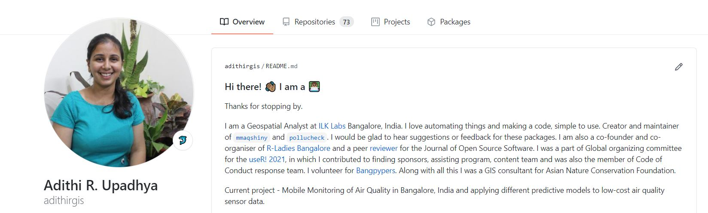

I have been wanting to make a personal website forever, but I am also a person who is super bad with colour combinations, beautification of stuff. So I kept pushing this, till I stumbled on [Silvia's website](https://silvia.rbind.io/). I directly contacted her and she was very nice and sweet to help me out throughout this. This website has been heavily inspired by Silvia's. 

## Why website(s)

I already had a [website](https://adithirgis.netlify.app/), but I wanted to add more content to it.  I was using my old website to share with people. So in the beginning of this year (2021), I was got selected for the [rstudio::global(2021)](https://blog.rstudio.com/2020/11/30/diversity-scholarships/) Diversity Scholarship. This year we had two amazing educators [Mine «etinkaya-Rundel](https://www2.stat.duke.edu/~mc301/) and [Alison Hill](https://alison.rbind.io/). 


Now the first thing that came to mind while making personal websites was do I really need one? Or why would anyone need a personal website? Then I remembered that a few people who worked with me always recommended that I should I have a website, and I kept telling myself the same thing. Website could be a your collection of work and blogs to share with others. So, if you work (any kind of work) or you like to blog, then you should definitely have a website. I had another strong reason to make my own website, which is I get a chance to work with R!

Reiterating that I have been a benefactor of kind communities I wanted to communicate my research struggles, learning in a systematic manner. So here is on of the outcomes of this journey. 

## How website(s)

During the Diversity Scholar tutorial sessions we were encouraged to have our own website. Alison's session had three ways to have your own website. There are many many ways, I know of only three ways and hence I discuss these three here. 

### First Method

Level : Everyone who owns a GitHub account. 

Requirements : [Github account](https://github.com/), your photo.

If you are not familiar with GitHub, I highly recommend using it. If you use R everyday then try [*Happy Git with R*](https://happygitwithr.com/). 

Number of minutes I took to complete it : 15

Procedure : 

- Create a new repository which has the same name as your username, eg: my user name in GitHub is adithirgis, so I will make a repo which I name as adithirgis. 

- Initialize the repo with a README.md, this is where you will write things. 

- This is a special repository, you can customize your repo. 

- You can add pictures, emoji's to this md file. 

- And definitely commit and push all the changes. 

- [Example](https://github.com/adithirgis) shown below of how it could look like. 



Detailed Resources :

- This is an awesome collection of variety of profiles, the links to the repo are also given - https://github.com/abhisheknaiidu/awesome-github-profile-readme. 

### Second Method

Level : Everyone who uses R. 

Requirements : [R](https://www.r-project.org/about.html), [RStudio](https://www.rstudio.com/), [rmarkdown](https://rmarkdown.rstudio.com/) package, [postcards](https://github.com/seankross/postcards) package, your photo. 

Number of minutes I took to complete it : 35

Procedure : 

- Open RStudio and install postcards package as shown below.

- There are multiple templates available in postcard package. Choose one of them. 

```r
require(remotes)
remotes::install_github("seankross/postcards@main")
postcards::create_postcard(template = "trestles")
```

- An `index.Rmd` file will be generated, customize it and knit it. 

- [Example](https://adithiru-shortbio.netlify.app/) shown below of how it could look like. 


- You can as well fork this repo from [here](https://github.com/adithirgis/short_bio). 

Detailed Resources :

- Here is the repo of this package and many other examples - https://github.com/seankross/postcards#getting-started. 


### Third Method

Alison had introduced this theme called Hugo Apéro and I was blown away by the beauty. It was work in progress back then and was supposed to be realsed for free. I was super happy becuase for a person who understands colours and art so less, this would be of great help. 

Level : Everyone who uses R and is interested to learn more. 

Requirements : [R](https://www.r-project.org/about.html), [RStudio](https://www.rstudio.com/), [rmarkdown](https://rmarkdown.rstudio.com/) package, [blogdown](https://bookdown.org/yihui/blogdown/) package, your photo. 

Number of minutes I took to complete it : 720

Procedure : 

- Open RStudio and install postcards package as shown below.

- There are multiple templates available in postcard package. Choose one of them. 

```r
require(blogdown)
new_site(theme = "hugo-apero/hugo-apero", format = "toml", sample = FALSE,
         empty_dirs = TRUE)
blogdown::serve_site()
blogdown::stop_server()
```

- An `index.Rmd` file will be generated, customize it and knit it. 

- [Example](https://adithiru-shortbio.netlify.app/) shown below of how it could look like. 


- You can as well fork this repo from [here](https://github.com/adithirgis/short_bio). 

Detailed Resources :

- Here is the repo of this package and many other examples - https://github.com/seankross/postcards#getting-started. 

 


