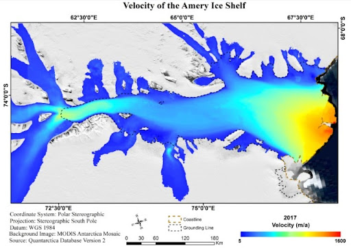

## Abstract

Glacier movement is a crucial factor for assessing cryospheric climate change. Traditional methods  of field  surveys for  studying glacier movement and velocity are often not possible owing to inaccessibility and harsh terrains. Furthermore, as it is not feasible to physically monitor and survey many glaciers around the globe, these traditional methods are limited in their global coverage. Remote sensing is  an ideal tool to study  such phenomena on a global  scale. Optical  remote sensing  employs techniques such as feature tracking and pixel tracking, whereas, microwave remote sensing uses intensity tracking, speckle tracking, Interferometric SAR and Differential InSAR (DInSAR). This  study focuses on  estimation of  glacier velocity and its  seasonal variations using the  image-matching technique for optical images for the glaciers in Antarctica. The tool used in this study  is the  COSI-Corr module  embedded  in ENVI which provides  the velocity  in both  azimuth and  range resolution. 

