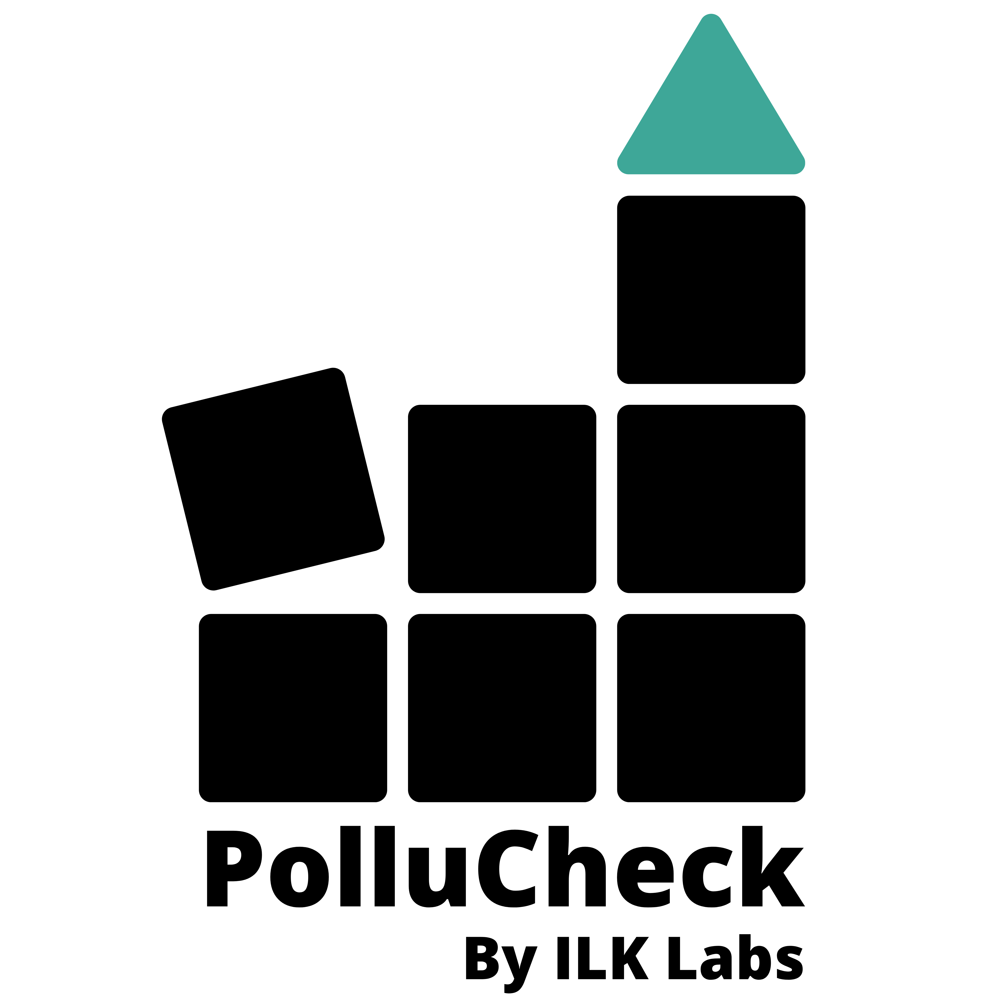

## Abstract

Pollution data from these sources are typically in different file formats and templates that require customised codes or programmes for analysis. Also, a rigorous quality check of the data is preferred before visualization (plotting) and reporting. *`pollucheck`* offers a single-stop
solution for

(i) handling the pollution data from the open-source databases,

(ii) applying a suite of quality check options,

(iii) generating a variety of summary statistics at various averaging intervals,

(iv) performing time series analysis,

(v) generating a bunch of temporal and statistical plots, and

(vi) comparing data from two input files.
